# Behaviorial Cloning
---
*Term 1, Project 3 of Udacity Self-Driving Car Nanodegree, by vuiseng9, Sept 2017*

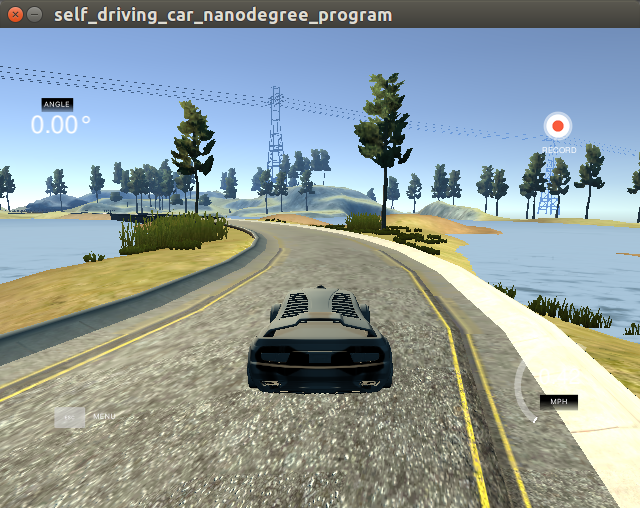

## Overview
The goal of this project is to use deep learning network to clone driving behavior. A driving simulator is provided and user driving data such as front-facing camera video, steering angle, speed etc will be recorded by simulator to serve as training data. A Convnet is devised to take the front-facing camera as input and regression of steering angle as output task. Once model is architected and trained, the model is deployed in simulator autonomous mode where simulator feeds the simulated front-facing view to the convnet and the model outputs the car steering angle. In this manner, the car achieves self-driving capability that is learned from the data, ie user driving behavior. Keras with Tensorflow backend will be the main framework for this project.

> [Complete codes in Jupyter notebook](https://github.com/vuiseng9/SDCND-P003-Behavioral-Cloning/blob/master/Behaviorial-Cloning.ipynb)

> [Self-driving on Lake Track at 15mph](https://youtu.be/HYh_9kceHa0)

> [Self-driving on Lake Track at 25mph](https://youtu.be/OZwO4q311ec)

## Setup
1. [Udacity's Self-Driving Car Simulator](https://github.com/udacity/self-driving-car-sim) - Usage Included
2. Optionally, you may start with [sample training data](https://d17h27t6h515a5.cloudfront.net/topher/2016/December/584f6edd_data/data.zip)
3. Training environment setup - [CarND Term1 Starter Kit](https://github.com/udacity/CarND-Term1-Starter-Kit) - it's recommended to use AWS EC2 for faster TPT 
4. Network Training
   ```bash
   cd <workdir>
   source activate carnd-term1
   export KERAS_BACKEND=tensorflow
   python model.py
   ```
5. Inference
   ```bash
   python drive.py model.h5

   # Then, launch simulator and select autonomous mode and track
   ```

## Data Collection & Selection
> 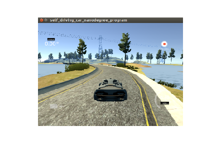 
> 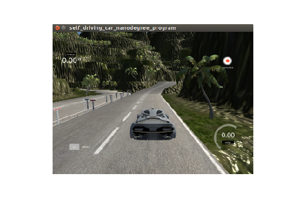

There are two tracks in the simulator, the lake track and the jungle track. The data collection is performed on the lake track only. In total, **about 6 laps of simulation are recorded, 3 laps each on clockwise and counter-clockwise direction.** 

> 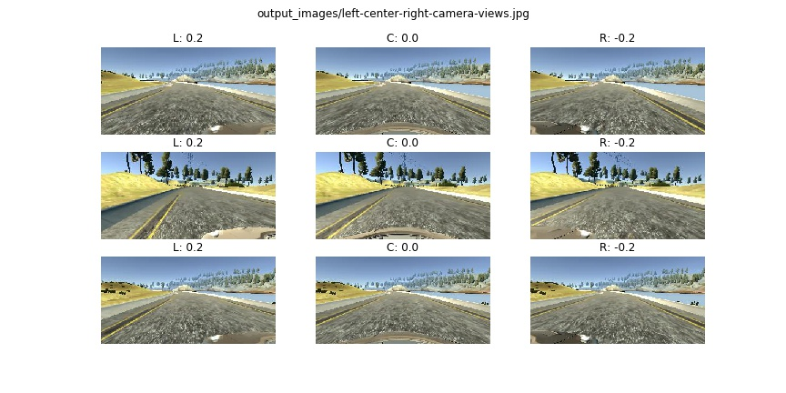

Above are random visualization of recorded frames from the front-facing cameras. Notice that there are left, center and right view, it is a neat feature from the simulator that it mimicks 3 front-facing cameras to achieve different views as a means to collect more data at the same time. Effectively, steering angle needs to be adjusted for the left and right camera. Left viewfinder appears to be closer to right edge of the lane, hence a negative compensation needs to be added to original recorded steering angle, meaning steering left. Whereas, a positive value will be added for the camera on the right. Ideally, accurate modelling is required to obtain correct steering angle, trigonometry calculation for instance. However for simplicity, as suggested in the project guide, **a constant offset of +-0.2 is applied.** With 3 cameras and 6 laps of collection, we have a total of 7597x3 frames. 

> 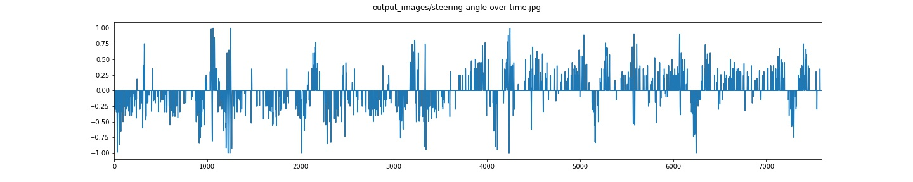

Above is the graph of steering angle over time index. 

Following is an important factor for data selection. Taking the initial collection for model training, we quickly find out that the car is having a huge inertia to turn. Then, a histogram is plotted to observe the distribution of the steering angle. From the histogram below, it is very obvious that the dataset is having an imbalance target, the number of steering angle between +-0.05 is over 5000, that is at least 10x more than the adjacent bins! This causes the model to be bias to not steer most of the time. To overcome this, we downsample the number of instances in this bin so that the histogram looks like a bell shape, closer to a gaussian distribution. 

> 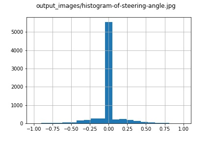

> 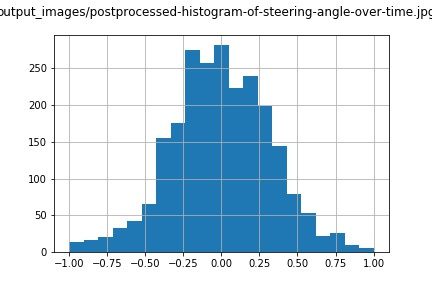

With that, we have now a total of **2334x3=7002 training examples**.

## Data Augmentation
Are 7 thousands frames able to make the car drive itself? probably okay for the training track. However, it is simply not enough of scenarios covered by the model. The question is that how do we get more scenarios/conditions without the time-consuming simulation in all sorts of driving tracks/settings? Yes, it is data augmentation that we learned in previous project. This section mainly describes the augmentation techniques used in this project.

1. **Random Lighting Conditions**
   > 

   In the lake track simulation, it is a grand weather, like summer. In reality, we would have different lighting conditions, to augment frames with different illumination conditions, ```modify_sat_lum``` is defined, it converts the input frame to HLS color space and randomizes the level in Saturation and Luminisance channel to achieve diverse lighting conditions. Look at the examples below, do you feel snowy winter, rainy day or fine day?

2. **Shadow Casting**
   > 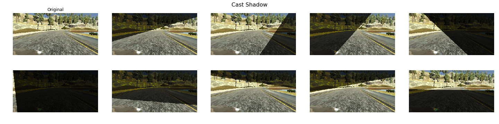

   As we have experienced in previous projects, shadow on roads, traffic signs is a fundamental issue to overcome. There is minimal or almost no shadow in lake track. We need to artificially introduce shadow to the model. It doesn't have to be exact, just visually similar to how shadow looks. A function ```cast_shadow``` is defined. The function randomly choose the side of shadow to be added, then randomly select the level of divider on both end to overlay a low opacity dark color to mimick shadow.

3. **Horizontal and Vertical Translation**
   > 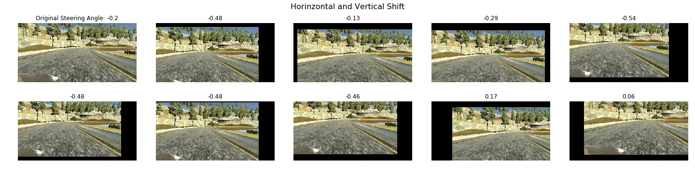

   Horizontal shift simulates more varying location of a car w.r.t. the lane whereas vertical shift variates the horizon elevation and results in effect of looking at an upcoming ascending or descending slope. The defined ```horizontal_vertical_shift``` function wraps the ```skimage.transform.AffineTransform``` API where translation can be performed by just input the relative shift in horizontal and vertical. It is important to rectify the steering angle since the modified view means car location has been changed. We assume vertical translation limit used here has almost neglible impact on steering angle. As for horizontal translation, we set the limit between -60 to 60 pixels, to compensate the steering angle, we settle with 0.007 per pixels after a series of trials and errors. 

4. **Rotation**
   > 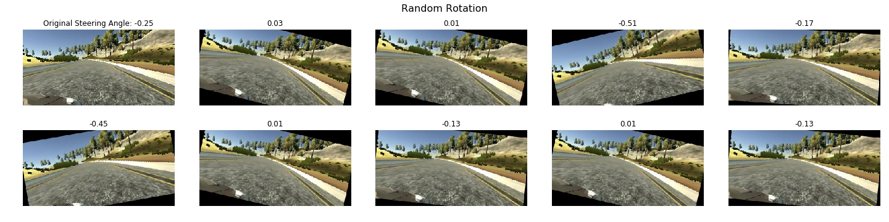

   Rotation may simulate diverse car orientation towards the lane boundary. The implementation ```rotate``` here has been learned from [stackoverflow thread](https://stackoverflow.com/questions/25895587/python-skimage-transform-affinetransform-rotation-center) that utilizes ```skimage.transform.SimilarityTransform```. The basic idea here is shifting the the vanishing perspective point to the origin, then rotation is performed and finally the rotated result is shifted back by initial offset. For the steering compensation, we decide 0.002 per angle rotated, this is based on manual calibration from rotated images to the similar view in the ground truth.

### Model Architecture and Training Strategy

### Generators
Before diving into the model architecture, an important technique introduced in this project is **generator**. Like it is pointed out in the tutorial, 10K traffic sign images is about 30MB but 10K simulator images would consume more than 1.5GB of memory, excluding copies made during intermediate processing. It is not practical, this is where generator comes in. Basically, generator is a function that only return a slice of data required by the main routine and remember its state, for instance, index of images to process. The next time the generator function is called, the subsequent slice of data is returned. In this way, all the training data is not required to load into the memory.

```python
def generator(samples, batch_size=32):
    num_samples = len(samples)
    while 1: #loop forever so the generator never terminates
        sklearn.utils.shuffle(samples)
        for offset in range(0, num_samples, batch_size):
            batch_samples = samples[offset:offset+batch_size]
            
            images = []
            measurements = []
            
            for batch_sample in batch_samples:
                # Make the file path for center, left and right images
                imgpth = './data/IMG/' + batch_sample[0].split('/')[-1]
                img = cv2.imread(imgpth)
                steering = float(batch_sample[1])
                
                # Chances of perform image augmentation
                if np.random.binomial(1, 0.7) > 0:
                    if np.random.choice([True, False]):
                        if np.random.choice([True, False]):
                            # Random rotation
                            img, steering = rotate(img, steering)
                        else:
                            # Random translation
                            img, steering = horizontal_vertical_shift(img, steering)
                    
                    # Randon lighting conditions
                    if np.random.choice([True, False]):
                        img = modify_sat_lum(img)

                    # Shadow Casting
                    if np.random.choice([True, False]):
                        img = cast_shadow(img)                        
                
                images.append(img)
                measurements.append(steering)

            X_train = np.array(images)
            y_train = np.array(measurements)
            yield sklearn.utils.shuffle(X_train, y_train)
```
Above is the generator defined in the project. We would like to highlight that data augmentation is done on the fly when generator is called and it is a random chance to perform augmentation as original images should be appeared to the model as well. To use generator in Keras, we need ```fit_generator``` to create the hook to our generator, like the snippet below. Notice there are training and validation generator, we perform a train-test split of 8:2 ratio, each generator is going to sample from their respective pool. ```steps_per_epoch``` is the number of generator called to form an epoch. From here, **the total images per epoch is 11203 for training and 2801 for validation.**
```python
model.fit_generator(train_generator, 
                    steps_per_epoch=len(train_samples)*2/32, 
                    validation_data=validation_generator, 
                    validation_steps=len(validation_samples)*2/32, 
                    epochs=10, callbacks=callbacks_list)
```
## Network Architecture
We started with LeNet architecture and it is able to do the job. For the purpose of learning & Keras familiarization, we would like to reference a powerful network, [NVIDIA Convnet](https://arxiv.org/pdf/1604.07316v1.pdf) has been chosen. The adapted network is shown in the table below. (extracted from Keras report)

| Layer (type)              | Output Shape        | Param # |
|---------------------------|---------------------|---------|
| cropping2d_1 (Cropping2D) | (None, 70, 320, 3)  | 0       |
| lambda_1 (Lambda)         | (None, 70, 320, 3)  | 0       |
| conv2d_1 (Conv2D)         | (None, 35, 160, 24) | 1824    |
| dropout_1 (Dropout)       | (None, 35, 160, 24) | 0       |
| conv2d_2 (Conv2D)         | (None, 18, 80, 36)  | 21636   |
| dropout_2 (Dropout)       | (None, 18, 80, 36)  | 0       |
| conv2d_3 (Conv2D)         | (None, 9, 40, 48)   | 43248   |
| dropout_3 (Dropout)       | (None, 9, 40, 48)   | 0       |
| conv2d_4 (Conv2D)         | (None, 3, 14, 64)   | 27712   |
| dropout_4 (Dropout)       | (None, 3, 14, 64)   | 0       |
| conv2d_5 (Conv2D)         | (None, 1, 5, 64)    | 36928   |
| dropout_5 (Dropout)       | (None, 1, 5, 64)    | 0       |
| flatten_1 (Flatten)       | (None, 320)         | 0       |
| dense_1 (Dense)           | (None, 100)         | 32100   |
| dense_2 (Dense)           | (None, 50)          | 5050    |
| dense_3 (Dense)           | (None, 10)          | 510     |
| dense_4 (Dense)           | (None, 1)           | 11      |
| loss (Mean Square Error)  |                     |         |
|                    | Total Trainable Parameters | 169,019 |

The network consists of:
1. An input utility layer that crops the input images to our region of interest. We ignore area above horizon which is approximated to be 70 pixels from the top of image and 20 pixels from the bottom are excluded as car hood is captured. Therefore the output layer is 70 in height and 320 in width with RGB channel. 

2. A Lambda layer that performs normalization, zero centering the input data.

3. 5 Convolution layers to serve as feature map layer. The first 3 use 5x5 kernel with 2x2 stride whereas the last 2 use 3x3 kernel with 3x3 stride. All of them are configured to perform same padding and they are followed by ReLU non-linear activation layer. Also, to prevent overfitting, dropout layer is appended to ReLU layer with 10% of dropout rate.

4. 4 fully-connected layers are followed after Conv layers, with diminishing number of hidden units.

5. The objective of the network is a regression of steering angle. Therefore the loss function is a root mean square error computation.

**The optimizer of choice is ADAM**, a variant of stochastic gradient descent that uses momentum and learning rate decay. Momentum is a way to determine the direction of descent by averaging historical gradient descent and learning rate decay means taking smaller descent in each iteration. Therefore, the learning rate will be calculated online in each epoch, in which they are dependant on the parameters of the ADAM optimizer in Keras. Default parameters are used.
```
Epoch 1/10
351/350 [==============================] - 157s - loss: 0.1074 - val_loss: 0.0876
Epoch 2/10
351/350 [==============================] - 155s - loss: 0.0863 - val_loss: 0.0812
Epoch 3/10
351/350 [==============================] - 155s - loss: 0.0794 - val_loss: 0.0761
Epoch 4/10
351/350 [==============================] - 155s - loss: 0.0732 - val_loss: 0.0675
Epoch 5/10
351/350 [==============================] - 155s - loss: 0.0694 - val_loss: 0.0644
Epoch 6/10
351/350 [==============================] - 154s - loss: 0.0662 - val_loss: 0.0642
Epoch 7/10
351/350 [==============================] - 156s - loss: 0.0641 - val_loss: 0.0612
**Epoch 8/10
  351/350 [==============================] - 155s - loss: 0.0643 - val_loss: 0.0610**
Epoch 9/10
351/350 [==============================] - 155s - loss: 0.0615 - val_loss: 0.0638
Epoch 10/10
351/350 [==============================] - 155s - loss: 0.0585 - val_loss: 0.0620
```

Above is the log of training with **batch size of 32** and 10 epochs. In this project, the magnitude of loss is not a good measure to select final model because the target, steering angles are mostly fabricated and they may be misapproximated. The way to decide final model is to look find the balance between the training loss and validation loss. At 8th epoch, the validation loss is at lowest and training loss is at about the same level. Going more epochs is overfitting as validation loss has worsened. With Keras history object, each model is saved after every epoch. **We have take the model of 8th epoch as final model.**

## Results and Discussion

The speed in ```drive.py``` is set at 9 miles per hour and the final model performed well. We are interested how good it will respond when we increase the speed. Furthur testing, the model is able to drive autonomously in considerably fluent manner up to 25 miles per hours. At 30 miles per hour, the car still stays within the track but it oscillates too much that it is dangerous. Following are links to final autonomous driving videos.

> [Self-driving on Lake Track at 15mph](https://youtu.be/HYh_9kceHa0)

> [Self-driving on Lake Track at 25mph](https://youtu.be/OZwO4q311ec)

It would be interesting to see how model responds to the input images. Following are plots of Conv layer 1 and Conv layer 2. The hot pixels are mainly at the lane boundaries, they are the results of the trained convolution filters and these would be the pixels influencing the output. Also not that the some filters are very hot outside of the lane boundary, they are strong signals for model to take actions.

> 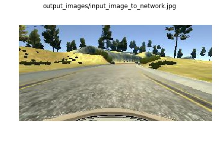
> 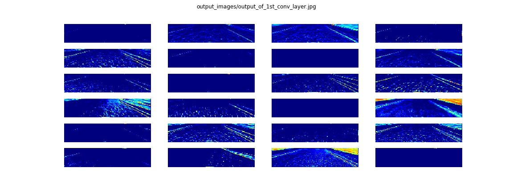
> 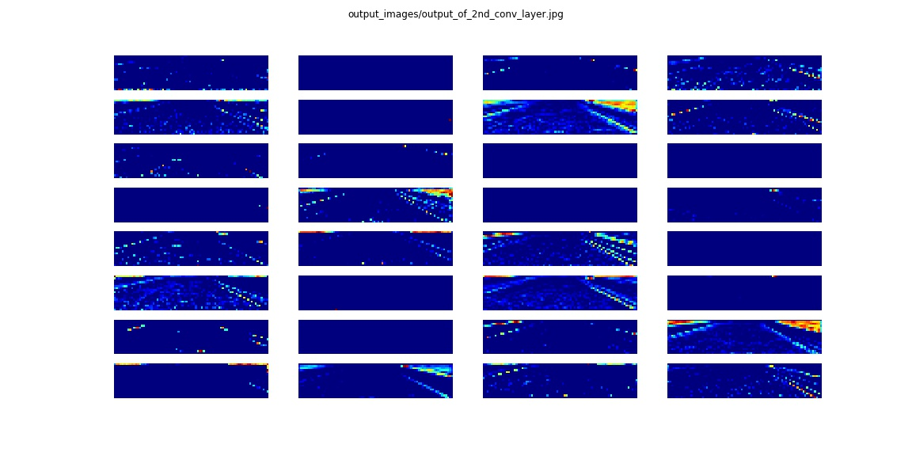

**Future work** - Get the model to drive on jungle track. The idea is not to collect data on jungle track but to augment enough scenarios to training data. Currently, it is not able to work due to a number of challenges: 1. sharper turns 2. more varying elevation 3. multiple lane boundaries that may confuse model and model has to stay within correct lane. 4. accurate modelling of the steering angle. (shearing the images was attempted but wasn't able to get the right correction factor)
